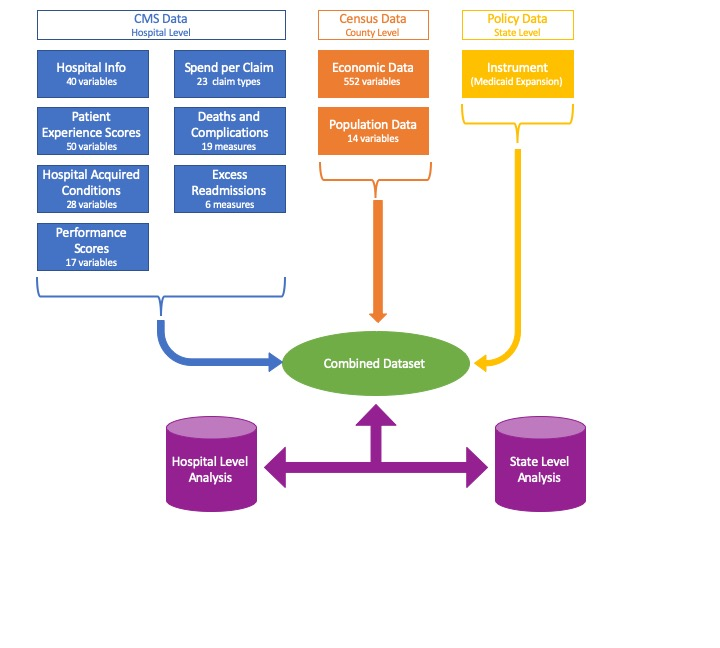

```{r setup, include=FALSE}
knitr::opts_chunk$set(echo = TRUE)
```

## Background 

As the US is making greater strides towards a value based care system, it will become critical to understand the relationship between better outcomes and cost efficiency. When compared to other similar countries, the [US currently spends far more and has worse health outcomes](http://www.oecd.org/els/health-systems/Health-at-a-Glance-2013.pdf).


The current US healthcare system operates under a fee-for-service payment scheme, which encourages a "quantity over quality" approach to healthcare. When a hospital's payment depends on how *many* services they can provide and not the *value* of those services, the focus of care shifts from a patient-centric experience to a payment-centric experience. 

Using Medicare as a paradigm, we have examined the relationship between spending, outcomes, and other extrinsic driving factors of quality within states and hospitals. Furthermore, we have attempted to investigate the relationship between a state's healthcare policymaking behavior and their Medicare outcomes.


## Related Work

We were inspired by the multitudinous lectures during orientation that focus on lagging US healthcare outcomes. Our ideas were also driven by the current political climate and the debates surrounding Medicare For All. We wanted to frame the topical question of US healthcare with a focus on hospitals. 


## Initial Questions

We originally wanted to understand 1) general trends in Medicare spending and outcomes by state; 2) the way that costs are associated with outcomes in individual hospitals; and 3) the association between healthcare policy focused states and outcomes. However, measuring quality is not so easily done. CMS collects and maintains hundreds of datasets. We sifted through these datasets to find the quality measures that we believed were most relevant and interesting, although there is much left unexplored.

When modeling the relationship between the costs and the selected outcomes, it is important to understand that hospitals have many factors that contribute to their outcomes. While we collected information on many socioeconomic and demographic factors that would help us understand hospital-level variation, there are certainly some confounding variables that we are not accounting for. 

Finally, to explore the relationship between outcomes and healthcare policy focused states, we decided to use Medicaid Expansion as an instrumental variable to represent "healthcare policy focused states". However, as we will discuss later, Medicare is a federally run program, resulting in lukewarm (although still interesting) results for this analysis. 


## Data Collection

Data were collected from a variety of sources.

#### gen can write this ####




## Exploratory Analysis: What visualizations did you use to look at your data in different ways? What are the different statistical methods you considered? Justify the decisions you made, and show any major changes to your ideas. How did you reach these conclusions?

```{r}
##########################################
#Load Libraries
##########################################

rm(list=ls())
library(DBI)
library(dplyr)
library(tidyverse)
library(ggplot2)
library(ggthemes)
library(knitr)


##########################################
#Establish Connection and pull data
#See prior scripts (labeled 01 and 02) for loading and master table build and data wrangling
##########################################

#setwd("/Users/genevievelyons/Intro to DS/bst260-final-proj/code")
con <- dbConnect(RSQLite::SQLite(), "../database/db.sqlite")

master <- dbFetch(dbSendQuery(con,"select * FROM master_hospital_table"))

## Set up Categorical Median Household Income by Quartile
master$income_cat[master$median_household_income <= 46180.25] <- 1
master$income_cat[master$median_household_income > 46180.25 & master$median_household_income <= 53626] <- 2
master$income_cat[master$median_household_income > 53626 & master$median_household_income <= 62532] <- 3
master$income_cat[master$median_household_income > 62532] <- 4
master$income_cat <- as.factor(master$income_cat)

#Convert meaningful use into factor
master$meets_criteria_for_meaningful_use_of_ehrs <- as.factor(master$meets_criteria_for_meaningful_use_of_ehrs)
```


```{r}
summary(master$ip_spend); sd(na.omit(master$ip_spend)) #Median 11,482; sd 2,651.519
hist(master$ip_spend)
hist(log10(master$ip_spend))
summary(master$hospital_level_complications_score); sd(na.omit(master$hospital_level_complications_score))

```


histograms, tables, naive regressions, a few scatterplots 

## Final Analysis


### State Comparison Tool 


### Association between Postoperative Complications and Costs 

We analyzed the relationship between hospitals' postoperative complications in the inpatient setting, such as "Blood stream infection after surgery" and inpatient spending per claim. We used a linear least squares regression with a quadratic transformation on inpatient spending per claim to model this relationship. We adjusted for other significant factors, including hospital ownership (e.g., "Government - Federal" and "Government - Local"), whether the hospital offers emergency services, whether the hospital meets the criteria for for meaningful use of EHRs, the number of hospitals per capita in the surrounding county, socioeconomic factors of the surrounding county icluding median income, population, and the percentage of residents without health insurance, region, and whether the state is a "healthcare policy focused state" (i.e., Medicaid Expansion Instrumental Variable).


```{r}
##########################################
# Regression
##########################################

mod_hospital_complications <- lm(hospital_level_complications_score ~ 
                                   ip_spend + 
                                   I(ip_spend^2) + 
                                   hc_policy_focused_state+
                                   ip_spend * hc_policy_focused_state + 
                                   hospital_ownership + 
                                   hospital_density_per_100k_capita+
                                   emergency_services+
                                   income_cat+
                                   pop_census_2017+
                                   region+
                                   meets_criteria_for_meaningful_use_of_ehrs+
                                   I(pop_no_healthinsurance/pop_denominator_healthinsurance),
                                 data = master)
summary(mod_hospital_complications)


#Interpretation
4.036e-04*11500-8.999e-09*11500^2+1.536e-05*11500 - (4.036e-04*9500-8.999e-09*9500^2+1.536e-05*9500) #0.459962 - HC focused
(4.036e-04*11500-8.999e-09*11500^2+1.536e-05*11500 - (4.036e-04*9500-8.999e-09*9500^2+1.536e-05*9500))/(4.036e-04*9500-8.999e-09*9500^2+1.536e-05*9500) #14.5% - HC focused
4.036e-04*11500-8.999e-09*11500^2 - (4.036e-04*9500-8.999e-09*9500^2) #0.429242 - not HC focused
(4.036e-04*11500-8.999e-09*11500^2 - (4.036e-04*9500-8.999e-09*9500^2))/(4.036e-04*9500-8.999e-09*9500^2) #14.2% - not HC focused
```


The 95% confidence interval estimates are:

```{r}
kable(confint(mod_hospital_complications))
```


All else being equal, a hospital in a state with a healthcare policy focus with an average IP spend per claim of \$11,500 has a postoverative complications score 14.5% higher than a hospital that spends $2k per claim less (14.2% in non-healthcare policy focused states).


```{r}


##########################################
# Visualizations
##########################################

#Limit the data so we can graph the model
lim_complications <- master %>%
  mutate(perc_no_healthinsurance = pop_no_healthinsurance/pop_denominator_healthinsurance) %>%
  select (hospital_level_complications_score,
            ip_spend,
            hc_policy_focused_state,
            hospital_ownership,
            hospital_density_per_100k_capita,
            emergency_services,
            income_cat,
            pop_census_2017,
            region,
            meets_criteria_for_meaningful_use_of_ehrs,
            perc_no_healthinsurance,
            state) 

lim_complications <- lim_complications %>% filter(complete.cases(lim_complications) == T)

#histogram of costs and outcomes

## The fitted model - National - Hospital Type
lim_complications %>% 
  ggplot()+
  geom_point(aes(ip_spend,hospital_level_complications_score, color = hospital_ownership), alpha = 0.7)+
  geom_line(aes(ip_spend,fitted(mod_hospital_complications)), color = "blue") + 
  facet_wrap(. ~ region + hc_policy_focused_state)

#Smoothed Model - National - Hospital Type
lim_complications %>% 
  ggplot()+
  geom_point(aes(ip_spend,hospital_level_complications_score, color = hospital_ownership), alpha = 0.7)+
  geom_smooth(aes(ip_spend,fitted(mod_hospital_complications))) + 
  facet_wrap(. ~ region + hc_policy_focused_state)


## The fitted model - National - Income cat
lim_complications %>% 
  ggplot()+
  geom_point(aes(ip_spend,hospital_level_complications_score, color = income_cat), alpha = 0.7)+
  geom_line(aes(ip_spend,fitted(mod_hospital_complications)), color = "blue") + 
  facet_wrap(. ~ region + hc_policy_focused_state)

#Smoothed Model - National - Income cat
lim_complications %>% 
  ggplot()+
  geom_point(aes(ip_spend,hospital_level_complications_score, color = income_cat), alpha = 0.7)+
  geom_smooth(aes(ip_spend,fitted(mod_hospital_complications))) + 
  facet_wrap(. ~ region + hc_policy_focused_state)

```


### Association between Patient Experience Measure - Responsiveness of Hospital Staff and Costs 


 All else being equal, a hospital in a state with a healthcare policy focus with an average IP spend per claim of \$11,500 has a postoverative complications score 14.5% higher than a hospital that spends $2k per claim less (14.2% in non-healthcare policy focused states).
 
 The policy focused IV - would not make a difference necessarily because MCr is a federally run program and this shows that Medicare is insensitive to state-level policy making differences (although NOT insensitive to state-level socioeconomic/demographic differences, as seen by the region variable). This is a GOOD thing. We would expect it to be diff if we looked at MCD quality or commercial or exchange or non-federal.


