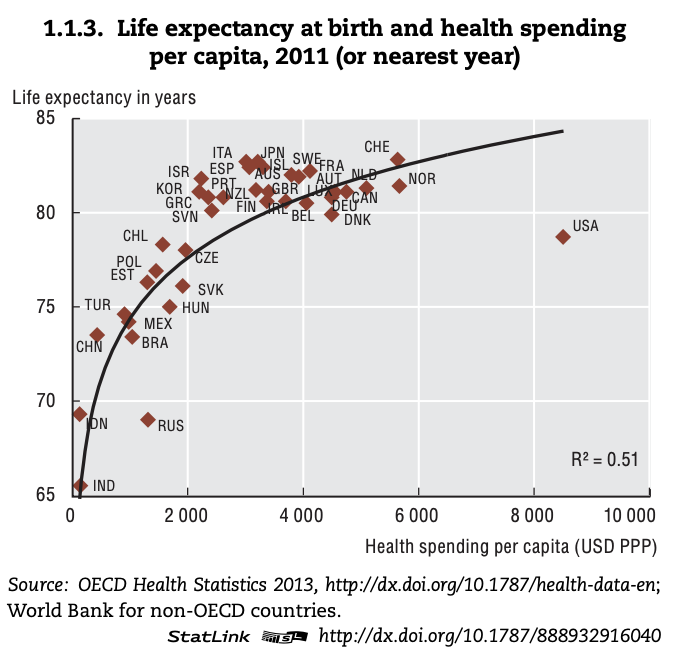
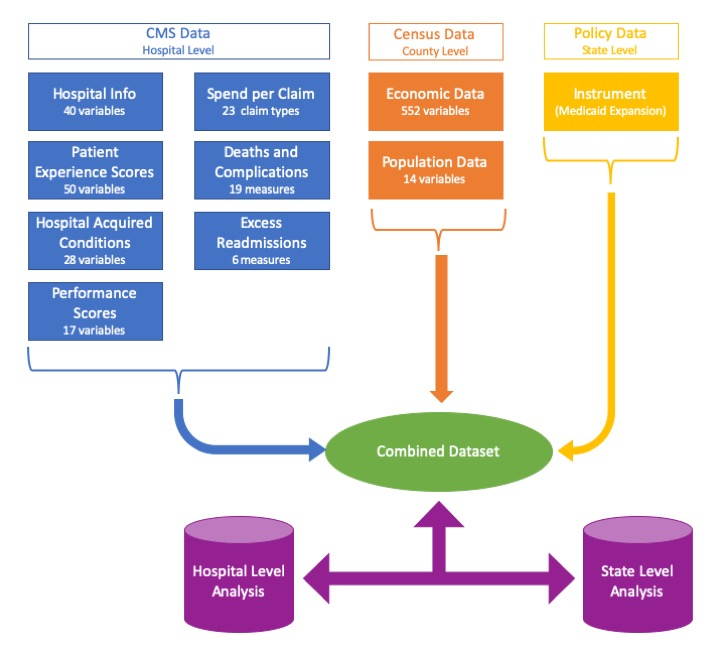

```{r setup, include=FALSE}
knitr::opts_chunk$set(echo = TRUE)
```

## Background 

As the US is making greater strides towards a value based care system, it will become critical to understand the relationship between better outcomes and cost efficiency. When compared to other similar countries, the [US currently spends far more and has worse health outcomes](http://www.oecd.org/els/health-systems/Health-at-a-Glance-2013.pdf).



The current US healthcare system operates under a fee-for-service payment scheme, which encourages a "quantity over quality" approach to healthcare. When a hospital's payment depends on how *many* services they can provide and not the *value* of those services, the focus of care shifts from a patient-centric experience to a payment-centric experience. 

Using Medicare as a paradigm, we have examined the relationship between spending, outcomes, and other extrinsic driving factors of quality within states and hospitals. Furthermore, we have attempted to investigate the relationship between a state's healthcare policymaking behavior and their Medicare outcomes.


## Related Work

We were inspired by the multitudinous lectures during orientation that focus on lagging US healthcare outcomes. Our ideas were also driven by the current political climate and the debates surrounding Medicare For All. We wanted to frame the topical question of US healthcare with a focus on hospitals. 


## Initial Questions

We originally wanted to understand 1) general trends in Medicare spending and outcomes by state; 2) the way that costs are associated with outcomes in individual hospitals; and 3) the association between healthcare policy focused states and outcomes. However, measuring quality is not so easily done. CMS collects and maintains hundreds of datasets. We sifted through these datasets to find the quality measures that we believed were most relevant and interesting, although there is much left unexplored.

When modeling the relationship between the costs and the selected outcomes, it is important to understand that hospitals have many factors that contribute to their outcomes. While we collected information on many socioeconomic and demographic factors that would help us understand hospital-level variation, there are certainly some confounding variables that we are not accounting for. 

Finally, to explore the relationship between outcomes and healthcare policy focused states, we decided to use Medicaid Expansion as an instrumental variable to represent "healthcare policy focused states". However, as we will discuss later, Medicare is a federally run program, resulting in lukewarm (although still interesting) results for this analysis. 


## Data Collection

### Key Data Sources: 

The Center for Medicare and Medicaid Services (CMS) publishes costs and outcomes datasets related to Medicare claims at acute care hospitals each year in the [CMS Hospital Compare Datasets](https://data.medicare.gov/data/hospital-compare). These datasets are structured as CSV files.

The [US Census Bureau](https://www.census.gov/data.html) publishes data related to socio-economic factors by county. 

Medicaid Expansion has been used as in Instrumental Variable to model states that prioritize healthcare in their policymaking. 

All data was ingested into a SQLite relational database and then combined. All analyses conducted were done using a denormalized analysis table that was created. 

### Key Data Elements and Data Documentation

Data Elements Collected at the Hospital Level:

* [Postoperative Complications Score](https://data.medicare.gov/Hospital-Compare/Complications-and-Deaths-Hospital/ynj2-r877) - Complications and deaths scores for Medicare hospital claims, including only complications and deaths that occurred postoperatively.
* [Patient Experience Measure: Responsiveness of Hospital Staff](https://data.medicare.gov/Hospital-Compare/Hospital-Value-Based-Purchasing-HVBP-Patient-Exper/avtz-f2ge) - Patient Experience of Care Domain Scores for Responsiveness of Hospital Staff (Hospital Value-Based Purchasing Program)
* [Inpatient and Total Spend per Claim](https://data.medicare.gov/Hospital-Compare/Medicare-Hospital-Spending-by-Claim/nrth-mfg3) - average spending levels during hospitals’ Medicare Spending per Beneficiary (MSPB) episodes for inpatient and all claims (respectively). These represent price-standardized, non-risk-adjusted values. An MSPB episode includes all Medicare Part A and Part B claims paid during the period from 3 days prior to an inpatient hospital admission through 30 days after discharge. 
* [Hospital Ownership](https://data.medicare.gov/Hospital-Compare/Hospital-General-Information/xubh-q36u) - Hospital ownership, such as Proprietary, Voluntary Non-Profit - Private, Government - Local, etc.
* Hospital Density per 100,000 Residents - Calculated as the number of hospitals in the county per 100,000 residents in that county.
* [Emergency Services](https://data.medicare.gov/Hospital-Compare/Hospital-General-Information/xubh-q36u) - Indicates presence of emergency services at a hospital.
* [Meets Criteria for Meaningful Use of EHRs](https://data.medicare.gov/Hospital-Compare/Hospital-General-Information/xubh-q36u) - Indicates if is using certified EHR technology in a [meaningful manner to improve care](https://www.cdc.gov/ehrmeaningfuluse/introduction.html).

Data Elements Collected at the County Level:

* Income Category - Median household income in the county. Defined as < \$46,000, \$46,000 - \$53,000, \$53,000 - \$62,500, and > \$62,500
* Population - Population of the county.
* Region - Northeast, North Central, South, and West
* Percent Uninsured - Calculated as the population without health insurance in the county divided by the population in the county.

Data Elements Collected at the State Level:

* Healthcare policy focused state - Medicaid Expansion has been used as in Instrumental Variable to model states that prioritize healthcare in their policymaking.





## Exploratory Analysis

```{r, warning=F, message=F}
##########################################
#Load Libraries
##########################################

rm(list=ls())
library(DBI)
library(dplyr)
library(tidyverse)
library(ggplot2)
library(ggthemes)
library(knitr)
library(sjPlot)
library(sjmisc)
library(sjlabelled)


##########################################
#Establish Connection and pull data
#See prior scripts (labeled 01 and 02) for loading and master table build and data wrangling
##########################################

#setwd("/Users/genevievelyons/Intro to DS/bst260-final-proj/code")
con <- dbConnect(RSQLite::SQLite(), "../database/db.sqlite")

master <- dbFetch(dbSendQuery(con,"select * FROM master_hospital_table"))

## Set up Categorical Median Household Income by Quartile
master$income_cat[master$median_household_income <= 46000] <- 1
master$income_cat[master$median_household_income > 46000 & master$median_household_income <= 53000] <- 2
master$income_cat[master$median_household_income > 53000 & master$median_household_income <= 62500] <- 3
master$income_cat[master$median_household_income > 62500] <- 4
master$income_cat <- as.factor(master$income_cat)

#Convert meaningful use into factor
master$meets_criteria_for_meaningful_use_of_ehrs <- as.factor(master$meets_criteria_for_meaningful_use_of_ehrs)
```


```{r}
summary(master$ip_spend); sd(na.omit(master$ip_spend)) #Median 11,482; sd 2,651.519
hist(master$ip_spend)
hist(log10(master$ip_spend))
summary(master$hospital_level_complications_score); sd(na.omit(master$hospital_level_complications_score))

```


What visualizations did you use to look at your data in different ways? What are the different statistical methods you considered? Justify the decisions you made, and show any major changes to your ideas. How did you reach these conclusions?
histogram of the cost variables; the outcome variables
naive regressions (only one input)
histogram of costs/outcomes stratifying by instrumental variable 
perhaps a few scatter plots 

## Final Analysis

### State Comparison Tool 

We first analyzed the data at the state-level to identify high level trends in Medicare spending and outcomes. `app.R` contains a tool that will allow you to compare states. Using this tool, it is easy to dig into the relationship between  outcome measures and costs. 

We note that, when examining postoperative complications by state, there are three outliers with high complications rates: North Dakota, Nebraska, and Colorado. When viewing the hospital staff responsiveness by state, there is a lot of state-level variation in the way patients are rating the staff responsiveness of a hospital. The trend isn’t so clear.

However, when viewing the data as presented on the second tab, we can compare hospital staff responsiveness compared to the total spend per claim, and we see a definite trend -- as fee-for-service spending increases, the patient experience suffers. There are similar results for the postoperative complications -- complications increase with spending.

The analyses to follow dig into the relationship between two outcome measures (Postoperative Complications and Responsiveness of Hospital Staff) and Costs. For each outcome measure, we do regressions, confidence interval estimates, segment by covariates, and visualize.

### Association between Postoperative Complications and Costs 

We analyzed the relationship between hospitals' postoperative complications in the inpatient setting, such as "Blood stream infection after surgery" and inpatient spending per claim. We used a linear least squares regression with a quadratic transformation on inpatient spending per claim to model this relationship. We adjusted for other significant factors, including hospital ownership (e.g., "Government - Federal" and "Government - Local"), whether the hospital offers emergency services, whether the hospital meets the criteria for for meaningful use of EHRs, the number of hospitals per capita in the surrounding county, socioeconomic factors of the surrounding county including median income, population, and the percentage of residents without health insurance, region, and whether the state is a "healthcare policy focused state" (i.e., Medicaid Expansion Instrumental Variable).


#### Regression Model

```{r}
##########################################
# Regression
##########################################

mod_hospital_complications <- lm(hospital_level_complications_score ~ 
                                   #I(ip_spend/1000) + 
                                   I((ip_spend/1000)) * hc_policy_focused_state + 
                                   I((ip_spend/1000)^2) + 
                                   hc_policy_focused_state+
                                   hospital_ownership + 
                                   hospital_density_per_100k_capita+
                                   emergency_services+
                                   income_cat+
                                   pop_census_2017+
                                   region+
                                   meets_criteria_for_meaningful_use_of_ehrs+
                                   I(pop_no_healthinsurance/pop_denominator_healthinsurance),
                                 data = master)
tab_model(mod_hospital_complications)
#summary(mod_hospital_complications)

#Interpretation
x1.1 <- 11.5
x1.2 <- 9.5

coefficients(mod_hospital_complications)[2]*x1.1+coefficients(mod_hospital_complications)[4]*x1.1^2+coefficients(mod_hospital_complications)[24]*x1.1 - (coefficients(mod_hospital_complications)[2]*x1.2+coefficients(mod_hospital_complications)[4]*x1.2^2+coefficients(mod_hospital_complications)[24]*x1.2) #0.45961 - HC focused

(coefficients(mod_hospital_complications)[2]*x1.1+coefficients(mod_hospital_complications)[4]*x1.1^2+coefficients(mod_hospital_complications)[24]*x1.1 - (coefficients(mod_hospital_complications)[2]*x1.2+coefficients(mod_hospital_complications)[4]*x1.2^2+coefficients(mod_hospital_complications)[24]*x1.2) ) / (coefficients(mod_hospital_complications)[2]*x1.2+coefficients(mod_hospital_complications)[4]*x1.2^2+coefficients(mod_hospital_complications)[24]*x1.2) #14.5% - HC focused


(coefficients(mod_hospital_complications)[2]*x1.1+coefficients(mod_hospital_complications)[4]*x1.1^2 - (coefficients(mod_hospital_complications)[2]*x1.2+coefficients(mod_hospital_complications)[4]*x1.2^2) ) / (coefficients(mod_hospital_complications)[2]*x1.2+coefficients(mod_hospital_complications)[4]*x1.2^2) #14.2% - not HC focused
```


The 95% confidence interval estimates are:

```{r}
kable(confint(mod_hospital_complications))
```


#### Interpretation

All else being equal, a hospital in a state with a healthcare policy focus with an average IP spend per claim of \$11,500 has a postoperative complications score 14.5% higher than a hospital that spends $2k per claim less (14.2% in non-healthcare policy focused states).

Of course, there is a reverse causation element to be considered here -- hospitals with lower quality (and usually higher costs) would tend to have more post-operative complications such as "Blood stream infection after surgery". Then, in turn, because of the complications, these hospitals will undoubtedly have higher costs. This creates a cycle of costs-and-complications. Note however that for the purposes of this analysis we were sure to include only complications that would reflect the hospital's quality, i.e. those that occurred post-operatively, and we excluded complications that may be reflective of extrinsic factors, such as "Death rate for heart failure patients".

We noted that our healthcare policy focus IV does not have a significant effect on the outcomes and in fact appears to be harmful (14.5% vs 14.2%). We believe our instrument may not have been effective in this case because Medicare is a federally run program, so this shows that Medicare outcomes and spending is insensitive to state-level policy making differences, although it is *not* insensitive to regional socioeconomic/demographic differences, as seen by the region and county-level variables. We may expect to get different results if our analysis focused on a program that is run on a local level, such as Medicaid, the exchange, or a commercial plan.

#### Visualization


```{r}
##########################################
# Visualizations
##########################################

#Limit the data so we can graph the model
lim_complications <- master %>%
  mutate(perc_no_healthinsurance = pop_no_healthinsurance/pop_denominator_healthinsurance) %>%
  select (hospital_level_complications_score,
            ip_spend,
            hc_policy_focused_state,
            hospital_ownership,
            hospital_density_per_100k_capita,
            emergency_services,
            income_cat,
            pop_census_2017,
            region,
            meets_criteria_for_meaningful_use_of_ehrs,
            perc_no_healthinsurance,
            state) 

lim_complications <- lim_complications %>% filter(complete.cases(lim_complications) == T)
lim_complications$hc_policy_focused_state[lim_complications$hc_policy_focused_state ==0] <- "Not Healthcare Policy Focused"
lim_complications$hc_policy_focused_state[lim_complications$hc_policy_focused_state ==1] <- "Healthcare Policy Focused"
levels(lim_complications$income_cat) <- c("< $46,000","$46,000 - $53,000","$53,000 - $62,500","> $62,500")
```


The graphs below demonstrate the results of the fitted model. Generally speaking, there is a quadratic effect between inpatient spend per claim and the postoperative complications score. Each region looks markedly different, likely due to demographic factors that were not accounted for in our census data. The relationship for hospitals in the northern and western states have a much higher slope than the southern states.

```{r}
## The fitted model - National - Hospital Type
lim_complications %>% 
  ggplot()+
  #Scatter
  geom_point(aes(ip_spend,hospital_level_complications_score, color = income_cat), alpha = 0.7)+
  #Fitted line
  geom_line(aes(ip_spend,fitted(mod_hospital_complications)), color = "blue") + 
  #Wrap
  facet_wrap(. ~ region + hc_policy_focused_state)+ 
  #Labels
  theme(legend.position = "bottom") +
  ylab("Postoperative Complications Score") +
  xlab("Inpatient Spend per Claim") +
  labs(color = "Income Category") +
  ggtitle("Postoperative Complications Score vs Inpatient Spend per Claim", subtitle = "Medicare Hospitals, 2017") 
```

In Massachusetts specifically, the trend is almost perfectly linear, with higher inpatient spend associated with higher postoperative complications. Also note that the higher income counties tend to fall in the lower quadrant of this graph, with low percentage of the population uninsured, low postoperative complications, and low spend per claim. The upper right quadrant of the graph is dominated by hospitals residing in counties with a smaller median income and higher percentage uninsured. There are a few outliers with low postoperative complications and low inpatient spend per claim that are also low income. Investigation of these hospitals shows that they are all very close to one another in Springfield, Massachusetts.

```{r}
## The fitted model - National - Hospital Type
lim_complications %>% 
  filter(state == "MA") %>%
  ggplot()+
  #Scatter
  geom_point(aes(ip_spend,hospital_level_complications_score, color = income_cat, size = perc_no_healthinsurance), alpha = 0.7)+
  #Fitted line
  geom_line(aes(ip_spend,fitted(mod_hospital_complications)[lim_complications$state == "MA"]), color = "blue") + 
  #Labels
  theme(legend.position = "right") +
  ylab("Postoperative Complications Score") +
  xlab("Inpatient Spend per Claim") +
  labs(color = "Income Category", size = "Percent without Health Insurance") +
  ggtitle("Postoperative Complications Score vs Inpatient Spend per Claim - Massachusetts", subtitle = "Medicare Hospitals, 2017") 
```


### Association between Patient Experience Measure - Responsiveness of Hospital Staff and Costs 

We analyzed the relationship between the results of patient experience surveys, specifically the Responsiveness of Hospital Staff score, and total cost per claim. Note that total cost was more appropriate in this setting than inpatient costs as was previously analyzed, because postoperative complications will occur in the inpatient setting but responsiveness of hospital staff occurs in both the inpatient and outpatient setting. 

We used a linear least squares regression with a quadratic transformation on total spending per claim to model this relationship. We adjusted for other significant factors, including hospital ownership (e.g., "Government - Federal" and "Government - Local"), whether the hospital offers emergency services, whether the hospital meets the criteria for for meaningful use of EHRs, the number of hospitals per capita in the surrounding county, socioeconomic factors of the surrounding county including median income, population, and the percentage of residents without health insurance, region. Our initial analysis also considered whether the state is a "healthcare policy focused state" (i.e., Medicaid Expansion Instrumental Variable), but that term was not significant so it was excluded. As noted above, this term is likely not significant because Medicare is a federally run program which is not sensitive to state-level policy decisions. The results may be different if we were to run this analysis on a payer's data that varies by region, such as Medicaid, exchange, commercial, etc.


#### Regression Model

```{r}
##########################################
# Regression
##########################################

mod_responsiveness <- lm(responsiveness_of_hospital_staff_performance_rate ~ 
                                   I(total_spend/1000) + 
                                   I((total_spend/1000)^2) + 
                                   #hc_policy_focused_state+
                                   #total_spend * hc_policy_focused_state + 
                                   hospital_ownership + 
                                   hospital_density_per_100k_capita+
                                   emergency_services+
                                   income_cat+
                                   pop_census_2017+
                                   region+
                                   meets_criteria_for_meaningful_use_of_ehrs+
                                   I(pop_no_healthinsurance/pop_denominator_healthinsurance),
                                 data = master)
tab_model(mod_responsiveness)
#summary(mod_responsiveness)

#Interpretation
((coefficients(mod_responsiveness)[2]*x1.1+coefficients(mod_responsiveness)[3]*x1.1^2) - (coefficients(mod_responsiveness)[2]*x1.2+coefficients(mod_responsiveness)[3]*x1.2^2))/(coefficients(mod_responsiveness)[2]*x1.2+coefficients(mod_responsiveness)[3]*x1.2^2) #15.1% change 

((coefficients(mod_responsiveness)[2]*x1.1+coefficients(mod_responsiveness)[3]*x1.1^2) - (coefficients(mod_responsiveness)[2]*x1.2+coefficients(mod_responsiveness)[3]*x1.2^2))#2.95 points lower for $2k diff in total spend
```


The 95% confidence interval estimates are:

```{r}
kable(confint(mod_responsiveness))
```


#### Interpretation

All else being equal, a hospital with an average total spend per claim of \$11,500 has a Responsiveness of Hospital Staff score 15.1% lower than a hospital that spends $2k per claim less. This makes intuitive sense because the fee-for-service payment scheme encourages a "quantity over quality" approach to care. Over-testing and providing more services than necessary yields a higher cost per claim, but does not increase patient satisfaction -- in fact, most patients don't enjoy being exposed to more tests/services than are necessary. This analysis, unlike the prior analysis, does not suffer from potential reverse causation, although it is possible that there are other confounding factors that have not been accounted for here.

We noted that the effect size of hospital density was high. Hospital density has been defined as the number of hospitals in the county per 100,000 residents On average, a hospital in a county with a given hospital density per capita (100,000 residents) had a responsiveness score that was 0.93 points higher than a hospital in a county with one less hospital per capita (100,000 residents). This makes intuitive sense, because the more hospitals serving a population, the faster the service.

There is also a large negative effect size for a hospital with emergency services vs no emergency services. On average, a hospital with emergency services had a responsiveness score that was 1.97 points lower than a hospital without emergency services. This is likely because of the long lines that result from emergency care. There are two contributing factors: 1) patients who seek non-emergency care may be deprioritized compared to emergency cases, and 2) patients who need emergency care are likely to be more disgruntled about any delay and may tend to score a hospital's responsiveness lower.


#### Visualization


```{r}
##########################################
# Visualizations
##########################################

#Limit the data so we can graph the model
lim_complications2 <- master %>%
  mutate(perc_no_healthinsurance = pop_no_healthinsurance/pop_denominator_healthinsurance) %>%
  select (responsiveness_of_hospital_staff_performance_rate,
            total_spend,
            hc_policy_focused_state,
            hospital_ownership,
            hospital_density_per_100k_capita,
            emergency_services,
            income_cat,
            pop_census_2017,
            region,
            meets_criteria_for_meaningful_use_of_ehrs,
            perc_no_healthinsurance,
            state) 

lim_complications2 <- lim_complications2 %>% filter(complete.cases(lim_complications2) == T)
lim_complications2$hc_policy_focused_state[lim_complications2$hc_policy_focused_state ==0] <- "Not Healthcare Policy Focused"
lim_complications2$hc_policy_focused_state[lim_complications2$hc_policy_focused_state ==1] <- "Healthcare Policy Focused"
levels(lim_complications2$income_cat) <- c("< $46,000","$46,000 - $53,000","$53,000 - $62,500","> $62,500")
```


The graphs below demonstrate the results of the fitted model. Generally speaking, there is a negative and quadratic effect between total spend per claim and the hospital responsiveness score. The regions do not look terribly different for this measure. 

```{r}
## The fitted model - National - Hospital Type
lim_complications2 %>% 
  ggplot()+
  #Scatter
  geom_point(aes(total_spend,responsiveness_of_hospital_staff_performance_rate, color = income_cat), alpha = 0.7)+
  #Fitted line
  geom_line(aes(total_spend,fitted(mod_responsiveness)), color = "blue") + 
  #Wrap
  facet_wrap(. ~ region)+ 
  #Labels
  theme(legend.position = "bottom") +
  ylab("Hospital Staff Responsiveness Score") +
  xlab("Total Spend per Claim") +
  labs(color = "Income Category") +
  ggtitle("Hospital Staff Responsiveness Score vs Total Spend per Claim", subtitle = "Medicare Hospitals, 2017") 
```

When comparing hospitals with emergency services to those without, there is an evident difference between the two populations'  responsiveness scores as total spend increases. 

```{r}
lim_complications2$emergency_services <- as.factor(lim_complications2$emergency_services)
levels(lim_complications2$emergency_services) <- c("No Emergency Services","Emergency Services")

## The fitted model - National - Hospital Type
lim_complications2 %>% 
  ggplot()+
  #Scatter
  geom_point(aes(total_spend,responsiveness_of_hospital_staff_performance_rate, color = income_cat), alpha = 0.7)+
  #Fitted line
  geom_line(aes(total_spend,fitted(mod_responsiveness)), color = "blue") + 
  geom_smooth(aes(total_spend, responsiveness_of_hospital_staff_performance_rate))+
  #Wrap
  facet_wrap(. ~ emergency_services)+ 
  #Labels
  theme(legend.position = "bottom") +
  ylab("Hospital Staff Responsiveness Score") +
  xlab("Total Spend per Claim") +
  labs(color = "Income Category") +
  ggtitle("Hospital Staff Responsiveness Score vs Total Spend per Claim", subtitle = "Medicare Hospitals, 2017") 
```


The positive correlation between hospital density and responsiveness is clear as well.

```{r}
## The fitted model - National - Hospital Type
lim_complications2 %>% 
  ggplot()+
  #Scatter
  geom_point(aes(hospital_density_per_100k_capita,responsiveness_of_hospital_staff_performance_rate, color = income_cat), alpha = 0.7)+
  #Fitted line
  geom_line(aes(hospital_density_per_100k_capita,fitted(mod_responsiveness)), color = "blue") + 
  geom_smooth(aes(hospital_density_per_100k_capita, responsiveness_of_hospital_staff_performance_rate))+
  #Lims
  scale_x_continuous(limits = c(0,6))+
  #Labels
  theme(legend.position = "bottom") +
  ylab("Hospital Staff Responsiveness Score") +
  xlab("Hospital Density Per 100,000 Residents") +
  labs(color = "Income Category") +
  ggtitle("Hospital Staff Responsiveness Score vs Hospital Density Per 100,000 Residents", subtitle = "Medicare Hospitals, 2017") 
```

In Massachusetts specifically, the trend is clearly negative, with higher total spend per claim associated with lower hospital responsiveness scores. Similar to the observations above, we note that higher income counties have lower spend per claim, higher responsiveness, and lower percentage of the population without health insurance. Again, the outlier hospitals with low income, low total spend per claim, and high responsiveness scores are all very close to one another in Springfield, Massachusetts.

```{r}
## The fitted model - National - Hospital Type
lim_complications2 %>% 
  filter(state == "MA") %>%
  ggplot()+
  #Scatter
  geom_point(aes(total_spend,responsiveness_of_hospital_staff_performance_rate, color = income_cat, size = perc_no_healthinsurance), alpha = 0.7)+
  #Fitted line
  geom_line(aes(total_spend,fitted(mod_responsiveness)[lim_complications2$state == "MA"]), color = "blue") + 
  #geom_smooth(aes(total_spend, responsiveness_of_hospital_staff_performance_rate))+
  #Labels
  theme(legend.position = "right") +
  ylab("Hospital Staff Responsiveness Score") +
  xlab("Total Spend per Claim") +
  labs(color = "Income Category", size = "Percent without Health Insurance") +
  ggtitle("Hospital Staff Responsiveness Score vs Total Spend per Claim - Massachusetts", subtitle = "Medicare Hospitals, 2017") 
```


## Conclusions and Next Steps

The public CMS Medicare data is a very powerful data source that can be used to understand high level trends in Medicare spending and outcomes. We have identified a positive association between spend per claim and hospital complications, although note that this may be in part due to reverse causation. We have identified a negative association between spend per claim and hospital staff responsiveness score, which may indicate that patients are less satisfied with hospitals that emphasize quantity over quality.

A large limitation of these datasets is that they do not contain data necessary to do more granular analysis, such as data stratified by procedure codes (e.g., DRGs, CPT-4s, etc.). This data is available for purchase from CMS. This would be an interesting extension to this project. Furthermore, it would be possible to extend this analysis to account for yearly variation in quality and costs. 


